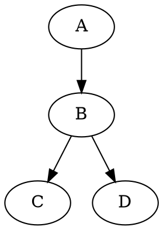

---
Presentation:
    width: 800
    height: 600
---
# Motivation
The motivation behind this project is that each of our imaging acquisition manuals are sent out to multiple sites in PDF format. Often we encounter situations where we need to conduct minor changes such as amend naming conventions of datasets or major changes like protocol amendment within the whole trial.

---

# Web-based Acquisition Help Center
I therefore build on top of current manual creation workflow, using Paligo to generate both PDF and HTML format of the acquisition manual. The goal here is to:
1. Get pharma-specific study manuals integrated with Perspectum Portal
2. Get generic manuals collected into one standalone help centre

---

# The Options We Want to Have
The acquisition help centre made, from the user point of view should meed this criteria:
- searchable
- easily navigate-able
- Independent

For the maintainer point of view
- sustainable
- able to trigger feedback
- able to interact with users (FAQs)

---

# Challenges We Met
- The new workflow for sure double the production work and resources
- More complicated engagement with cross team effort is required
- The whole publishing process is still manual

---

# Feedback is Always Welcomed
We are fairly new to **web designing** and **web developing** world. 
Feedback and support will be highly appreciated
## Thank you

<!--

-->