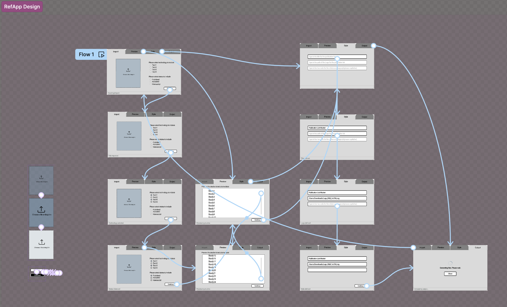

## Reference App

start date: 2022-08-04
last update: 2024-03-03

Background: This reference app takes a `.csv` or `.xlsx` file as input which contains a spreadsheet of publications and generate a word document (.`docx`) that showcase the citation and a crisp summary about the publication. The relevant metrics associated with each publication are DOI, title, technology and status. Ideally, the user can filter base on those metrics and generate summary `.docx` file for the specific attributes.

#### Thought process
This project should use python libraries 
- use `pandas` to organise the filtered data frame base on attribute input by the user
- scrape citations from PubMed or Google Scholar with `beautiful soup`  and `requests`
- read in a word template (with bespoke styling) and write the citation into a `.docx` with specified styling
- create an app to bundle all of it together as a GUI with `python wx`

> I wrote a [blog post](https://whyseeyc.notion.site/My-approach-to-build-and-app-44ebb276353d47bd92bcff5b589e36e5) about this project, please feel free to checkout!

#### Design

If interested in the action flow, please feel free to test it out with the prototype file [here](https://www.figma.com/file/mMadKJC2IRD6kDRbJ2jUUK/Reference-App-Prototype?type=design&node-id=0%3A1&mode=design&t=x0auk5feZH33QC4U-1). Note that you might need to have a figma account and log in first before playing with the prototype file.

#### File structure
- `input/` contains the input files (.csv, .xlsx, .docx).
- `output/` contains the output .docx with proper styling
- `script/` currently are old script files in testing phase
- `README.md` this file
- `requirements.txt` contains the required python package for this project

#### Challenge
- `python wx` was a very complicated library to work with and the app does not present well visually. Having to put functional code into class-based code was also quite challenging
- The original code set up is not modularised enough and I need to do some significant clean up. 

#### Contribute
I am particularly frustrated with the `Python wx` library, if anyone has some experience or would recommend another option (I also consider web framework like Flask), please kindly let me know. 

